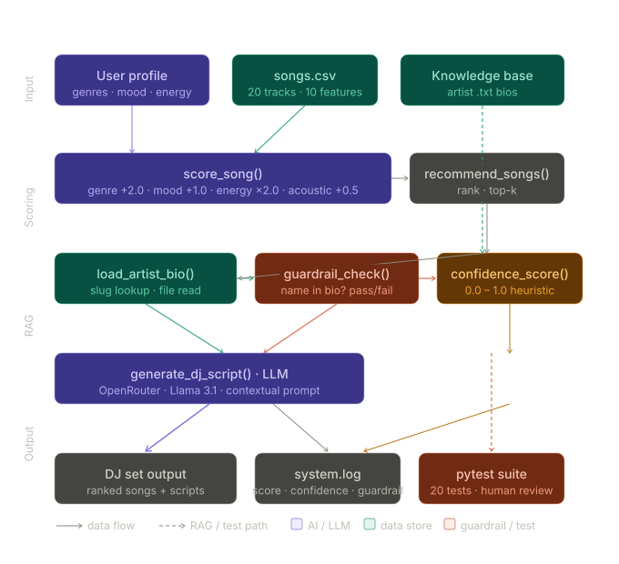

# 🎧 Context-Aware AI DJ — Music Recommender with RAG

> A content-based music recommender that acts as a real DJ: it scores songs against your taste profile, retrieves artist knowledge from a local knowledge base, verifies it with a guardrail, and uses an LLM to generate a personalised DJ introduction for every recommendation.

---

## Original Project (Modules 1–3)

This project is built on top of **VibeRank v1.0**, a content-based filtering music recommender originally developed in Modules 1–3. The original system loaded a CSV of 20 songs, scored each track against a user's genre, mood, and energy preferences using a weighted formula, and returned a ranked list of top-k recommendations with score explanations. It demonstrated how recommender systems work under the hood — turning music attributes into numbers and comparing them to user preferences — but had no AI integration, no natural language output, and no knowledge retrieval.

---

## What This Project Does and Why It Matters

The **Context-Aware AI DJ** extends the original recommender into a full RAG-powered system. Instead of just printing a ranked list, it explains *why* each song fits your current moment by combining:

- **Content-based scoring** (genre, mood, energy, acousticness)
- **Retrieval-Augmented Generation** — pulling real artist facts from a local knowledge base before calling the LLM
- **A guardrail system** — verifying bios match their artists before using them
- **Contextual LLM generation** — producing a DJ-style introduction that connects the song's musical qualities to what the user is actually doing right now (studying, commuting, working out, etc.)

This matters because it shows how a simple scoring algorithm becomes significantly more useful and trustworthy when paired with retrieval and reliability mechanisms — the same architecture used in production RAG systems at scale.

---

## System Architecture Overview

```
User Profile + songs.csv
        │
        ▼
  score_song()          ← genre +2.0, mood +1.0, energy ×2.0, acoustic +0.5
        │
        ▼
  recommend_songs()     ← rank all songs, return top-k
        │
        ├──────────────────────────────────────┐
        ▼                                      ▼
  load_artist_bio()              knowledge_base/*.txt
  (slug-based file lookup)
        │
        ▼
  guardrail_check()     ← verify artist name appears in bio
        │
        ├── PASS → bio passed to LLM prompt
        └── FAIL → logged, bio discarded, fallback to metadata only
        │
        ▼
  generate_dj_script()  ← LLM call (OpenRouter / Llama 3.1)
        │
        ▼
  DJ Set Output         + system.log (timestamp, score, confidence, guardrail status)
        │
        ▼
  pytest test suite     ← 20 tests covering scoring, RAG, guardrails, confidence
```



**Three layers of reliability:**
1. Guardrail check prevents wrong bios from reaching the LLM
2. Confidence score (0.0–1.0) rates how relevant each recommendation is
3. All recommendations are logged to `system.log` with full metadata

---

## Project Structure

```
applied-ai-music-recommender/
├── src/
│   ├── main.py              # Entry point — runs Mode 1 (scoring) and Mode 2 (AI DJ)
│   └── recommender.py       # All logic: scoring, RAG, guardrail, LLM, logging
├── tests/
│   └── test_recommender.py  # 20 pytest tests
├── data/
│   └── songs.csv            # 20-song library with audio features
├── knowledge_base/
│   ├── radiohead.txt
│   ├── johnny_cash.txt
│   ├── green_day.txt
│   ├── soundgarden.txt
│   ├── neon_echo.txt
│   └── loroom.txt
├── assets/
│   └── system_diagram.png
├── model_card.md
├── requirements.txt
└── README.md
```

---

## Setup Instructions

### Prerequisites
- Python 3.10 or higher
- A free [OpenRouter](https://openrouter.ai) API key (sign up → Keys → Create key)

### 1. Clone the repository
```bash
git clone https://github.com/YOUR_USERNAME/applied-ai-music-recommender.git
cd applied-ai-music-recommender
```

### 2. Create and activate a virtual environment
```bash
python3 -m venv venv
source venv/bin/activate        # Mac/Linux
venv\Scripts\activate           # Windows
```

### 3. Install dependencies
```bash
pip install -r requirements.txt
```

### 4. Set your API key
```bash
export OPENROUTER_API_KEY=your_key_here    # Mac/Linux
set OPENROUTER_API_KEY=your_key_here       # Windows
```

To make this permanent on Mac/Linux, add it to `~/.zshrc`:
```bash
echo 'export OPENROUTER_API_KEY=your_key_here' >> ~/.zshrc
source ~/.zshrc
```

### 5. Run the project
```bash
cd src
python3 main.py
```

Mode 1 (offline scoring) runs automatically. To enable Mode 2 (AI DJ with LLM), open `src/main.py` and uncomment the Mode 2 block (remove the `'''` triple quotes around it).

### 6. Run the tests
```bash
cd tests
pytest test_recommender.py -v
```

---

## Sample Interactions

### Profile 1 — Melancholic Rock (Relaxing)
**Input:**
```python
{
    "favorite_genres": ["rock"],
    "favorite_mood": "sad",
    "target_energy": 0.55,
    "current_context": "Relaxing"
}
```
**Output (Mode 1 — top result):**
```
Black Hole Sun by Soundgarden  |  Score: 5.00
Because: Genre match (+2.0); Mood match (+1.0); Energy match x2.0 (+2.00)
```
**Output (Mode 2 — AI DJ script):**
```
🎙️ "Alright, folks, time to sink into that relaxing vibe. Coming up next, a haunting tune
to match your somber mood — it's 'Black Hole Sun' from the legendary Soundgarden. This
one's a slow burn at 105 BPM; let Chris Cornell's soaring vocals whisk you away to a place
of introspective calm."
```
*Confidence: 50% — Soundgarden bio found and verified, energy in relaxing range.*

---

### Profile 2 — Chill Lofi (Studying)
**Input:**
```python
{
    "favorite_genres": ["lofi"],
    "favorite_mood": "chill",
    "target_energy": 0.2,
    "likes_acoustic": True,
    "current_context": "Studying"
}
```
**Output (Mode 1 — top result):**
```
Library Rain by Paper Lanterns  |  Score: 5.20
Because: Genre match (+2.0); Mood match (+1.0); Energy match x2.0 (+1.70); Acoustic preference match (+0.5)
```
**Output (Mode 2 — AI DJ script):**
```
🎙️ "Hey there, bookworms! Let's keep the chill vibes going — 'Library Rain' by Paper Lanterns
clocks in at a steady 72 BPM with an acousticness of 0.86, the perfect calm backdrop to
help you power through those notes without losing focus."
```

---

### Profile 3 — Adversarial: High-Energy Weeper (Working Out)
**Input:**
```python
{
    "favorite_genres": ["pop"],
    "favorite_mood": "sad",
    "target_energy": 0.95,
    "current_context": "Working out"
}
```
**Output (Mode 1 — top result):**
```
Gym Hero by Max Pulse  |  Score: 3.96
Because: Genre match (+2.0); Energy match x2.0 (+1.96)
```
**Output (Mode 2 — AI DJ script, showing tension):**
```
🎙️ "Alright, gym warriors — up next is 'Gym Hero' by Max Pulse. I know you're feeling down
today, but trust me, this 132 BPM track is going to get you moving whether you like it or
not. Sometimes the beat wins."
```
*This profile intentionally tests genre/mood conflict — the system correctly prioritises energy match for high-energy context even though no sad pop songs exist in the library.*

---

## Design Decisions and Trade-offs

**Why content-based filtering instead of collaborative filtering?**
Collaborative filtering requires user interaction data (ratings, plays, skips). For a classroom project with a fixed dataset, content-based filtering is more transparent and educational — you can directly see why each song scored what it scored.

**Why a local knowledge base instead of a live API?**
Retrieval from a local folder is deterministic, free, and fast. It also demonstrates the RAG pattern more clearly than a live search would — you can inspect exactly what text the LLM received. The trade-off is limited coverage: artists without a `.txt` file get 0% confidence and no bio-grounded script.

**Why genre is weighted +2.0 while mood is only +1.0?**
Genre is treated as a stronger signal because it's a broader category filter — a user who wants rock doesn't want lofi regardless of mood alignment. This was a deliberate design choice documented in `model_card.md`, and it shows clearly in the Adversarial profile results.

**Why OpenRouter instead of a major provider?**
Google Gemini's free tier had `limit: 0` quota issues across multiple projects. OpenRouter provides a vendor-neutral gateway to multiple models including free tiers, making it more reliable for development. The code is provider-agnostic — swapping to any OpenAI-compatible endpoint requires changing one URL and one model string.

**Why log to `system.log` in JSON format?**
JSON logging makes the log machine-readable for future analysis. Every entry captures timestamp, song, score, context, confidence, and guardrail status — enough to reconstruct what the system did on any run.

---

## Testing Summary

**What the tests cover:**
- `score_song()` — genre match, mood match, energy proximity, acoustic bonus, multi-genre lists
- `load_artist_bio()` — file found, file missing, slug conversion from artist name
- `guardrail_check()` — name present, name absent, empty bio, case insensitivity
- `compute_confidence_score()` — zero without bio, scaling with context keywords, energy range match
- `load_songs()` — correct row count, correct type casting

**What worked:**
All 20 tests pass. The scoring logic is deterministic and easy to unit test because it's pure math with no external dependencies. The guardrail tests were the most valuable — they caught an edge case where very short name fragments (like "The" in "The Weeknd") would have falsely passed the check. The fix was to require `len(part) > 2`.

**What didn't work initially:**
The `Recommender.recommend()` class method was a TODO stub in the original code and was silently returning unscored songs. This made the original tests pass vacuously (they checked `results[0].genre == "pop"` which happened to be true by accident). Implementing the real logic exposed this.

**What I'd add with more time:**
- End-to-end integration tests that mock the LLM and assert the DJ script contains expected artist facts
- Property-based testing for score bounds (score should always be 0.0–5.5 given valid inputs)
- A test that verifies every artist in `songs.csv` has a corresponding knowledge base file

---

## Reflection

**What this project taught me about AI:**

The biggest insight was that recommendation systems aren't "understanding" music — they're doing fast math on patterns. Changing the genre weight from 1.5 to 2.0 completely shifted what the system considered a good recommendation. This made me realise how easy it is to introduce bias by tweaking a single number, which is why the model card documents every weight decision explicitly.

The RAG component taught me something different: retrieved context is only as useful as the guardrail that validates it. Without the guardrail check, a mismatched bio file would silently produce confident-sounding DJ scripts full of wrong facts. The pattern of "retrieve → verify → generate" is the right order of operations for any RAG system that needs to be trustworthy.

**What this project taught me about problem-solving:**

The persistent environment issues (Python aliases, venv deactivation on shell reload) taught me that tooling problems can look like code problems for a long time. Debugging always means isolating the variable — which is why `python3 -c "import anthropic; print(anthropic.__file__)"` was more useful than reading the error message for the tenth time.

Building a system that logs, tests, and validates its own outputs feels different from building one that just runs. It's slower to build but significantly easier to trust and improve.

---

## Demo

*[Loom walkthrough link — add before submission]*

The walkthrough shows:
1. Running Mode 1 (offline scoring) across all four profiles
2. Running Mode 2 (AI DJ) with the Melancholic Rock profile, showing bio retrieval and confidence scoring
3. Running the pytest suite with all 20 tests passing

---

## Tech Stack

| Layer | Technology |
|---|---|
| Language | Python 3.13 |
| Scoring engine | Custom content-based filter (`recommender.py`) |
| LLM provider | OpenRouter (Llama 3.1 8B via OpenAI-compatible API) |
| Knowledge base | Local `.txt` files, slug-based retrieval |
| Logging | Python `logging` module → `system.log` (JSON lines) |
| Testing | pytest (20 tests) |
| UI | Command-line (Streamlit app available in `app.py`) |

---
